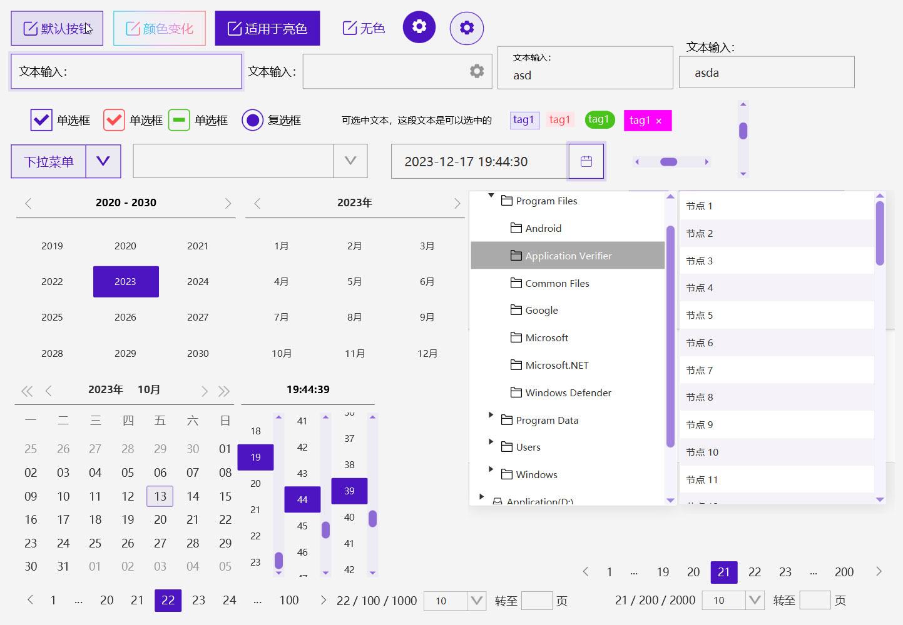

<h1 align="center">XmFx UI</h1>

本组件采用MIT协议，可自行使用。

## ✨特性

- 🎈 使用简单，专为Javafx定制的UI, 免去繁琐的css代码，通过简单的设置即可定制漂亮的UI
- 🎗 参考时下国内流行的WebUI结合Material设计适用于Java玩家的UI
- 🎨 内置多种颜色主题，也可根据需要自定义主题

## 🖥兼容性

- 基于java11，javafx19开发，如果有其他版本需求，请留言，或添加微信。

- 目前除了javafx8的getStyleSheets().add()不兼容以外，几乎所有版本应该都支持。 除了javafx8的getStyleSheets().add()方法外，更高的版本都是支持base64格式的css代码。
- 自定义css属性，本身就不支持通过setStyle()添加，只能通过引入css文件，或者getStyleSheets().add(base64)添加。这个与javafx版本无关
- 基于windows11平台开发，如果在其他平台出现组件显示异常，功能使用不正常情况，请留言，或添加微信。

## 📖文档

- [概述](doc/overview.md)

  

## 📦安装

- 本组件很多细节还在完善中，请自行clone后，通过eclipse/idea自行编译， 没有第三方包引入，很容易编译。

 ## 🤝 参考与引用

- [AlmasB/FXEventBus](https://github.com/AlmasB/FXEventBus) (这个组件可实现跨界面通信)
- [leewyatt/rxcontrols](https://github.com/leewyatt/rxcontrols) (多节点SVG组件)
- [controlsfx/controlsfx](https://github.com/controlsfx/controlsfx)(GridView)

