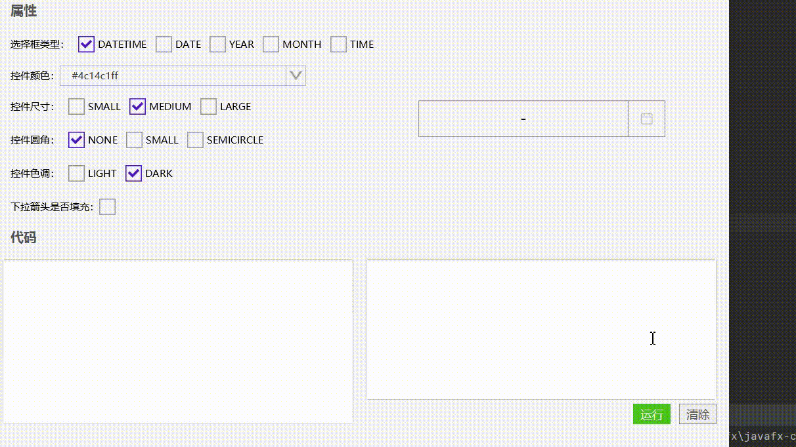

# 日期范围选择框(XmDateRangeSelector)




## 使用

```java
//简单使用
XmDateRangeSelector selector = new XmDateRangeSelector();
```


## 取值

```JAVA
selector.getSelectedStartDate();   //返回LocalDateTime格式的日期
selector.getSelectedEndDate();	   //返回LocalDateTime格式的日期
```


[日期范围选择框的实例代码(TestDateRangeSelector)](../../Example/src/main/java/com/xm2013/example/test/TestDateRangeSelector.java)

[日期范围选择框的实例代码(DateRangeSelectorPage)](../../Example/src/main/java/com/xm2013/example/example/page/DateRangeSelectorPage.java)


