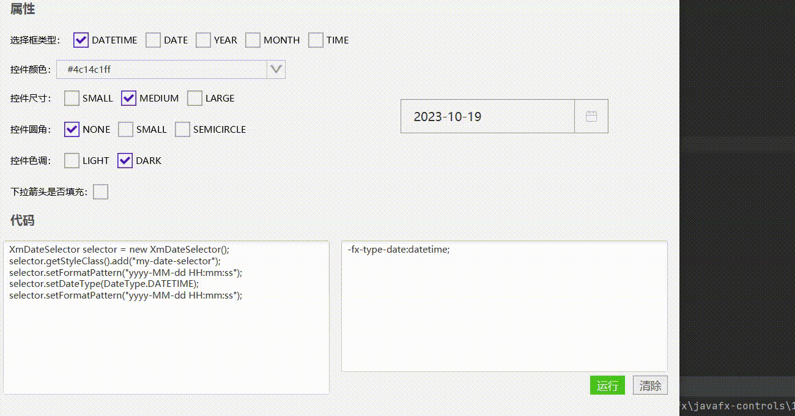

# 日期选择框(XmDateSelector)




## 使用

```java
//简单使用
XmDateSelector selector = new XmDateSelector();
```


## 取值

```JAVA
selector.getSelectedDate();   //这个返回LocalDateTime
selector.getFormateSelectedDate();  //返回设置的formatPattern格式的字符串格式的日期
```


[日期选择框的实例代码(TestDateSelector)](../../Example/src/main/java/com/xm2013/example/test/TestDateSelector.java)

[日期选择框的实例代码(DateSelectorPage)](../../Example/src/main/java/com/xm2013/example/example/page/DateSelectorPage.java)


