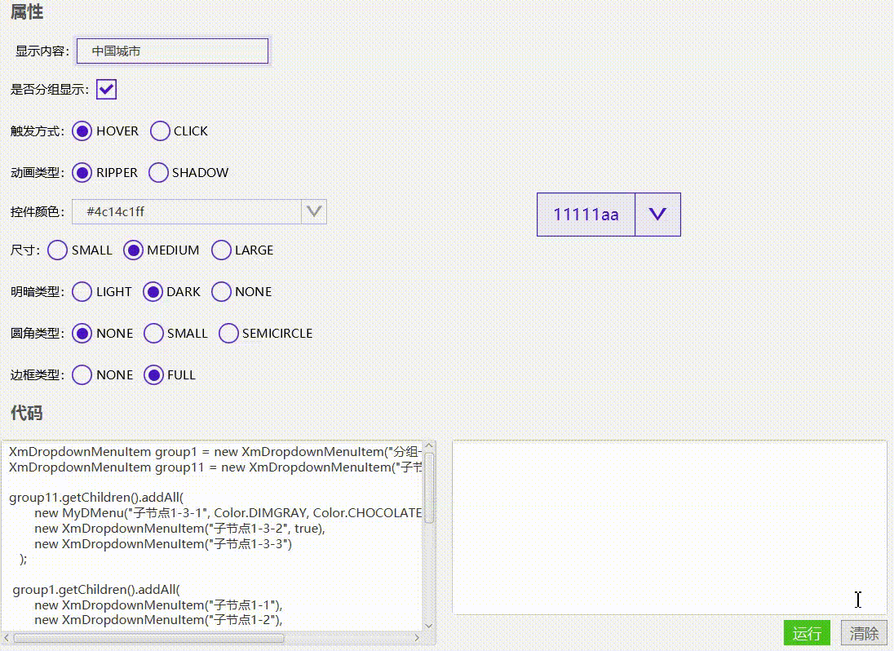

# 下拉菜单(XmDropdownMenu)




## 使用

```java
//useGroup = true，下拉菜单分组显示， 只有自己节点才能被选中和能触发点击事件
//useGroup = false, 下拉菜单的子节点以子菜单的形式显示，所有节点都可以被选中和触发选中事件
//继承DropdownMenuItem， 可以设置选显示条目的一些属性
XmDropdownMenuItem group1 = new XmDropdownMenuItem("分组一", new XmFontIcon("\ue65c"));
XmDropdownMenuItem group11 = new XmDropdownMenuItem("子节点1-3");

group11.getChildren().addAll(
       new MyDMenu("子节点1-3-1", Color.DIMGRAY, Color.CHOCOLATE),,
       new XmDropdownMenuItem("子节点1-3-2", true),
       new XmDropdownMenuItem("子节点1-3-3")
   );

 group1.getChildren().addAll(
       new XmDropdownMenuItem("子节点1-1"),
       new XmDropdownMenuItem("子节点1-2"),
       group11,
       new XmDropdownMenuItem("子节点1-4")
   );

XmDropdownMenuItem group2 = new XmDropdownMenuItem("分组二", new XmFontIcon("\ue65c"));
group2.getChildren().addAll(
       new XmDropdownMenuItem("子节点2-1"),
       new XmDropdownMenuItem("子节点2-2"),
       new XmDropdownMenuItem("子节点2-3"),
       new XmDropdownMenuItem("子节点2-4")
   );

XmDropdownMenu dropdownMenu = new XmDropdownMenu("11111aa");
dropdownMenu.getStyleClass().add("my-dmenu");
dropdownMenu.addItems(group1, group2);
dropdownMenu.setSizeType(SizeType.LARGE));
dropdownMenu.setBorderType(BorderType.NONE));
dropdownMenu.setHueType(HueType.DARK));
dropdownMenu.setClickAnimateType(ClickAnimateType.RIPPER));
dropdownMenu.setRoundType(RoundType.SMALL));
dropdownMenu.setText("中国城市1");
dropdownMenu.setColorType(ColorType.get("danger"));
//dropdownMenu.setUseGroup();

```


[下拉菜单的实例代码](../../Example/src/main/java/com/xm2013/example/example/page/DropdownMenuPage.java)


