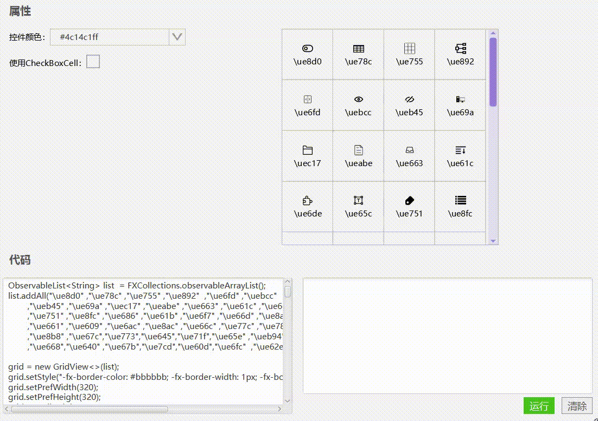

# 网格视图（GridView）




## 使用

1, 准备数据

```JAVA
ObservableList<String> list  = FXCollections.observableArrayList();
list.addAll("\ue8d0" ,"\ue78c" ,"\ue755" ,"\ue892"  ,"\ue6fd" ,"\uebcc"
            ,"\ueb45" ,"\ue69a" ,"\uec17" ,"\ueabe" ,"\ue663" ,"\ue61c" ,"\ue6de"  ,"\ue65c"
            ,"\ue751" ,"\ue8fc" ,"\ue686" ,"\ue61b" ,"\ue6f7" ,"\ue66d" ,"\ue8ad" ,"\ue646"
            ,"\ue661" ,"\ue609" ,"\ue6ac" ,"\ue8ac" ,"\ue66c" ,"\ue77c" ,"\ue787" ,"\ue758"
            ,"\ue8b8" ,"\ue67c","\ue773","\ue645","\ue71f","\ue65e" ,"\ueb94" ,"\ue6da"
            ,"\ue668","\ue640" ,"\ue67b","\ue7cd","\ue60d","\ue6fc"  ,"\ue62e");
```

2, 初始化

```java
grid = new GridView<>(list);
grid.setStyle("-fx-border-color: #bbbbbb; -fx-border-width: 1px; -fx-border-style:solid;");
grid.setPrefWidth(320);
grid.setPrefHeight(320);
grid.setCellHeight(75);
grid.setCellWidth(75);
grid.setHorizontalCellSpacing(0);
grid.setVerticalCellSpacing(0);
//grid.setCellFactory(...), 下边
```


3, 设置cellFactory

```java
//XmGridCell
grid.setCellFactory(new Callback<GridView<String>, GridCell<String>>() {
    @Override
    public GridCell<String> call(GridView<String> param) {
        return  new GridCell<>(){
            private XmLabel label ;
            private PseudoClass selected = PseudoClass.getPseudoClass("selected");
            private XmFontIcon icon = new XmFontIcon();
            @Override
            public void init() {
                super.init();
                //重写init方法可以实现一些基础设置

                label = new XmLabel();
                //lable可能会阻止事件冒泡，需要设置为不响应鼠标事件
                label.setMouseTransparent(true);

                itemProperty().addListener((ob, ov, nv)->{
                    if(nv!=null){
                        icon.setIcon(nv);
                    }
                });

                label.setGraphic(icon);
                label.setContentDisplay(ContentDisplay.TOP);
                label.setAlignment(XmAlignment.CENTER);

                //设置每一个的边框
                Color borderColor = Color.web("#bbbbbb");
                Color fontColor = Color.web("#444444");
                Paint hoverColor = param.getColorType().getPaint();
                Border border = new Border(new BorderStroke(
                        Color.TRANSPARENT, borderColor, borderColor, Color.TRANSPARENT,
                        BorderStrokeStyle.NONE, BorderStrokeStyle.SOLID, BorderStrokeStyle.SOLID, BorderStrokeStyle.NONE,
                        CornerRadii.EMPTY, new BorderWidths(1), Insets.EMPTY
                ));

                this.setBorder(border);

                //每一格hover时， 颜色变化
                this.hoverProperty().addListener((ob, ov, nv)->{
                    if (nv) {
                        if(selectedStateProperty().get()){
                            label.setTextFill(Color.WHITE);
                            icon.setColor(Color.WHITE);
                        }else{
                            label.setTextFill(hoverColor);
                            icon.setColor(hoverColor);
                        }
                    }else{
                        if(selectedStateProperty().get()){
                            label.setTextFill(Color.WHITE);
                            icon.setColor(Color.WHITE);
                        }else{
                            label.setTextFill(fontColor);
                            icon.setColor(fontColor);
                        }
                    }
                });

                //选中状态下，每一格的颜色
                selectedStateProperty().addListener((ob, ov, nv) -> {
                    updateSkin(nv);
                });
            }

            private void updateSkin(boolean selected){
                Color fontColor = Color.web("#444444");
                Paint hoverColor = param.getColorType().getPaint();
                if(selected){
                    setStyle("-fx-background-color: "+hoverColor.toString().replace("0x", "#"));
                    label.setTextFill(Color.WHITE);
                    icon.setColor(Color.WHITE);
                }else{
                    setStyle("-fx-background-color: transparent;");
                    if (isHover()) {
                        label.setTextFill(hoverColor);
                        icon.setColor(hoverColor);
                    }else{
                        label.setTextFill(fontColor);
                        icon.setColor(fontColor);
                    }
                }
            }

            @Override
            protected void updateItem(String item, boolean empty) {
                //先执行自己的逻辑，在调用super.updateItem(item, empty)
                if(empty){
                    setGraphic(null);
                    setText(null);
                }else{
                    String s = "\\u" + Integer.toHexString(item.charAt(0) | 0x10000).substring(1);
                    label.setText(s);
                    label.setGraphic(icon);
                    setGraphic(label);
                    setText(null);
                }
                super.updateItem(item, empty);
            }
        };
    }
});
```


```java
//XmCheckBoxGridCell
grid.setCellFactory(new Callback<GridView<String>, GridCell<String>>() {
    @Override
    public GridCell<String> call(GridView<String> param) {
        return new XmCheckBoxGridCell<>(){
            private XmFontIcon icon = new XmFontIcon();
            private XmLabel label;
            @Override
            public void init() {
               
                label = new XmLabel();
                 //lable可能会阻止事件冒泡，需要设置为不响应鼠标事件
                label.setMouseTransparent(true);
                label.setGraphic(icon);
                label.setContentDisplay(ContentDisplay.TOP);
                label.setAlignment(XmAlignment.CENTER);
                label.setPrefWidth(grid.getCellWidth());
                label.setPrefHeight(grid.getCellHeight());

                setAlignment(Pos.CENTER);

                checkBoxProperty().addListener((ob, ov, nv)->{
                    nv.setColorType(grid.getColorType());
                    nv.setStyle("-fx-padding: 6 0 0 6;");
                });

                Color borderColor = Color.web("#bbbbbb");
                Border border = new Border(new BorderStroke(
                        Color.TRANSPARENT, borderColor, borderColor, Color.TRANSPARENT,
                        BorderStrokeStyle.NONE, BorderStrokeStyle.SOLID, BorderStrokeStyle.SOLID, BorderStrokeStyle.NONE,
                        CornerRadii.EMPTY, new BorderWidths(1), Insets.EMPTY
                ));
                setBorder(border);

            }

            @Override
            public void updateItem(String item, boolean empty) {
                //先执行自己的逻辑，在调用super.updateItem(item, empty)
                
                if(empty){
                    setGraphic(null);
                    setText(null);
                }else{

                    String s = "\\u" + Integer.toHexString(item.charAt(0) | 0x10000).substring(1);
                    icon.setIcon(item);
                    label.setText(s);
                    label.setGraphic(icon);
                    setGraphic(label);
                    setText(null);

                }
                super.updateItem(item, empty);
            }
        };
    }
});
```


[实例代码(TestGridView)](../../Example/src/main/java/com/xm2013/example/test/TestGridView.java)

[实例代码(GridViewPage)](../../Example/src/main/java/com/xm2013/example/example/page/GridViewPage.java)


