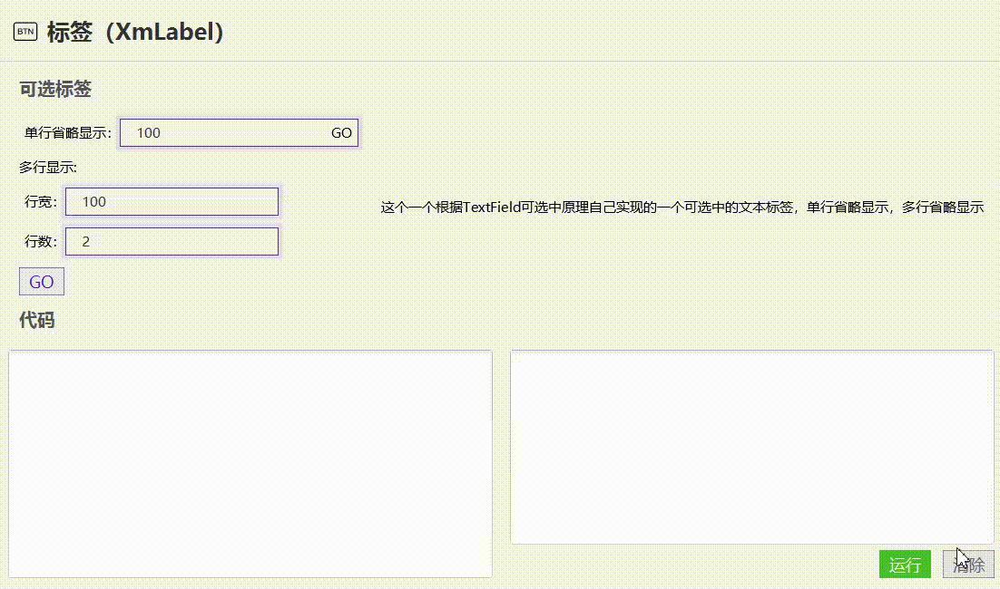

# 可选标签(XmLabel)




- 可选标签，可用于一些不可编辑但是需要选择的地方。
- 可选标签支持单行省略/多行省略


## 使用

```java
//简单使用
XmLabel label = new XmLabel("可选标签，可用于一些不可编辑但是需要选择的地方。可选标签支持单行省略/多行省略");
```

```java
//单行省略，文本最大宽度100， 最多显示一行，不换行， 超出100多余的省略
label.setTextWidth(100); 
label.setWrapText(false);
label.setMaxRow(1);
```


```java
//多行省略， 文本最大宽度100， 最多显示2行， 宽度超出100就会换行， 高度超过2行就会省略
label.setTextWidth(100);
label.setWrapText(true);
label.setMaxRow(2);
```


[可选标签的实例代码](../../Example/src/main/java/com/xm2013/example/example/page/LabelPage.java)


