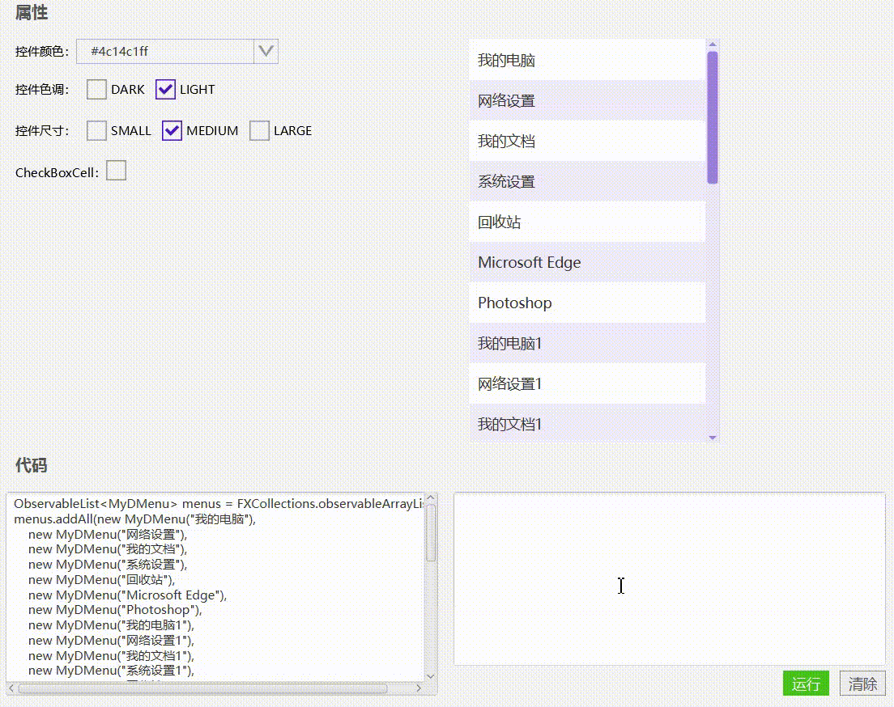

# 列表视图（XmListView）




## 使用

1, 准备数据

```java
ObservableList<MyDMenu> menus = FXCollections.observableArrayList();
menus.addAll(new MyDMenu("我的电脑"),
    new MyDMenu("网络设置"),
    new MyDMenu("我的文档"),
    new MyDMenu("系统设置"),
    new MyDMenu("回收站"),
    new MyDMenu("Microsoft Edge"),
    new MyDMenu("Photoshop"),
    new MyDMenu("我的电脑1"),
    new MyDMenu("网络设置1"),
    new MyDMenu("我的文档1"),
    new MyDMenu("系统设置1"),
    new MyDMenu("回收站1"),
    new MyDMenu("Microsoft Edge1"),
    new MyDMenu("Photoshop1"),
    new MyDMenu("我的电脑2"),
    new MyDMenu("网络设置2"),
    new MyDMenu("我的文档2"),
    new MyDMenu("系统设置2"),
    new MyDMenu("回收站2"),
    new MyDMenu("Microsoft Edge2"),
    new MyDMenu("Photoshop2"),
    new MyDMenu("我的电脑3"),
    new MyDMenu("网络设置3"),
    new MyDMenu("我的文档3"),
    new MyDMenu("系统设置3"),
    new MyDMenu("回收站3"),
    new MyDMenu("Microsoft Edge3"),
    new MyDMenu("Photoshop3")
);
```

2, 初始化

```java
listView = new XmListView<MyDMenu>(menus);
listView.getStyleClass().add(".my-listview");
listView.setHueType(HueType.LIGHT);
listView.setSizeType(SizeType.MEDIUM);
```

3, 设置cellFactory

```java
//XmListCell
listView.setCellFactory(new Callback<ListView<MyDMenu>, ListCell<MyDMenu>>() {
    @Override
    public ListCell<MyDMenu> call(ListView<MyDMenu> param) {
        return new XmListCell<>(){
            @Override
            protected void updateItem(MyDMenu item, boolean empty) {
                super.updateItem(item, empty);
                if(empty || item == null){
                    setText(null);
                }else{
                    setText(item.getLabelName());
                }
            }
        };
    }
});

//XmCheckBoxListCell
listView.setCellFactory(new Callback<ListView<MyDMenu>, ListCell<MyDMenu>>() {
    @Override
    public ListCell<MyDMenu> call(ListView<MyDMenu> param) {
        return new XmCheckBoxListCell(){
            @Override
            public void updateItem(Object item, boolean empty) {
                if(empty || item == null){
                    setText(null);
                }else{
                    setText(((MyDMenu)item).getLabelName());
                }
                super.updateItem(item, empty);
            }
        };
    }
});

```


## 取值

```java
//如果是：XmListCell
listView.getSelectionModel().getSelectedItem();

//如果是：XmCheckBoxListCell。
//通过listView.getSelectionModel().getSelectedItem();可以获取最后选中值
listView.getCheckedValues();
```


[实例代码(TestListView)](../../Example/src/main/java/com/xm2013/example/test/TestListView.java)

[实例代码(ListViewPage)](../../Example/src/main/java/com/xm2013/example/example/page/ListViewPage.java)


