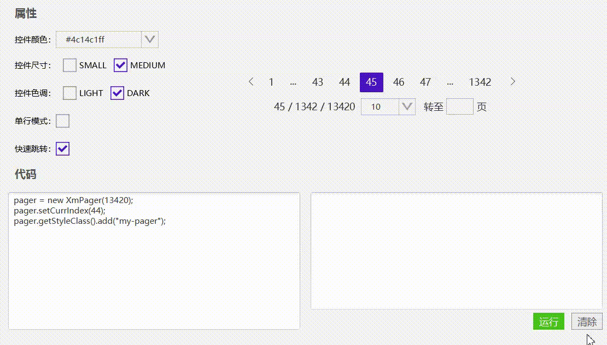

# 分页器(XmPager)




## 使用

```java
//简单使用
XmPager pager = new XmPager(10000);
pager.setShowQuickJumper(true);
pager.setSingleLine(false);
pager.setSizeType(SizeType.MEDIUM);
pager.setHueType(HueType.DARK);
```


## 取值

```JAVA
//这个一般是监听页面变化来实时获取数据
pager.currIndexProperty().addListener((ob, ov, nv)->{
	//nv就是新页面 
});
```


[分页器的实例代码(TestPager)](../../Example/src/main/java/com/xm2013/example/test/TestPager.java)

[分页器的实例代码(PagerPage)](../../Example/src/main/java/com/xm2013/example/example/page/PagerPage.java)


