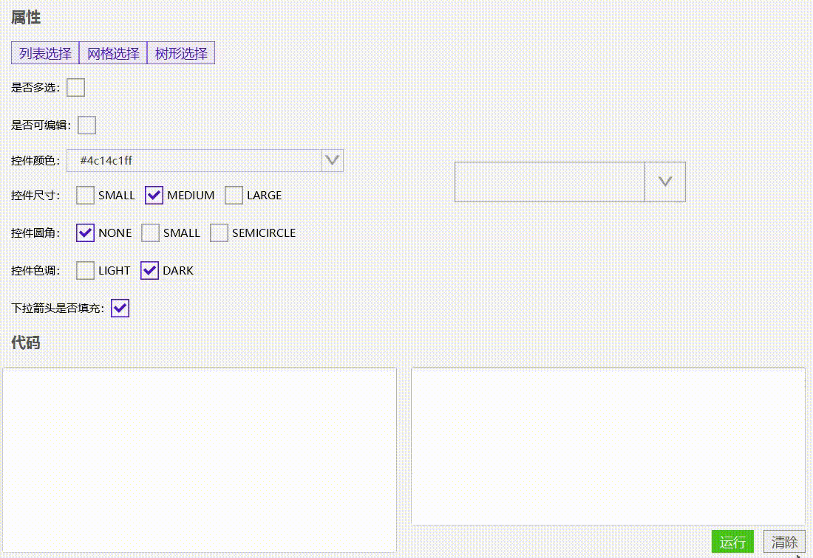

# 下拉选择框(XmSelector)




- 下拉框支持，列表，网格，树形结构


## 使用

### 下拉列表

```java
//列表支持
//建议设置converter, toString用于选中后的显示，fromString用于转换成value, 
SelectorConvert<SelectorItem> convert = new SelectorConvert<SelectorItem>() {
    @Override
    public String toString(SelectorItem object) {
        return object!=null?object.getLabel():null;
    }

    @Override
    public SelectorItem fromString(String string) {
        return new MySelectorItem(string);
    }
};

XmSelector<SelectorItem> selector = new XmSelector<SelectorItem>();
//显示的最大条目，如果没有设置，则全部显示
//最大条目是在多选的情况下才有作用
selector.setMultiple(true);
selector.setMaxTagCount(3);

selector.setHueType(HueType.LIGHT);
selector.setPromptText("请选择");
selector.setConverter(convert);
selector.setPrefWidth(250);

//准备数据， 通过继承SelectorItemBase，可以设置一些属性。
for(int i=0; i<50; i++){
    final int index = i;
    selector.getItems().add(new MySelectorItem("节点 "+(i+1)){
        /**
         * SelectorItemBase 设置了tag颜色，这里自定义颜色
         * @return
         */
        @Override
        public ColorType getSelectedColorType() {
            if(index%2 == 0){
                return ColorType.success();
            }else{
                return null;
            }
        }

        /**
        * SelectorItemBase 设置了tag的色调类型，这里自定义颜色
        * @return
        */
        @Override
        public HueType getSelectedHueType() {
            if(index%2 == 0){
                return HueType.LIGHT;
            }else{
                return HueType.DARK;
            }
        }
    });
}

//设置回调函数
selector.setCellFactory(new SelectorCellFactory<SelectorItem>() {
    @Override
    public void updateItem(IndexedCell<SelectorItem> cell, SelectorItem item, boolean empty) {
        if (empty || item == null) {
            cell.setText(null);
        } else {
            String text = selector.getConverter().toString(item);
            cell.setText(text);
        }
    }
});
```


### 下拉网格

```java
//设置converter
SelectorConvert<File> convert = new SelectorConvert<File>() {
    @Override
    public String toString(File object) {
        return object!=null?object.getName():null;
    }

    @Override
    public File fromString(String string) {
        return new File(string);
    }
};

XmSelector<File> selector = new XmSelector<File>();

//显示的最大条目，如果没有设置，则全部显示
//最大条目是在多选的情况下才有作用
selector.setMultiple(true);
selector.setMaxTagCount(3)

selector.setPromptText("请选择");
selector.setSelectorType(SelectorType.GRID);  //设置网格显示
selector.setConverter(convert);
selector.setRoundType(RoundType.CIRCLE);
selector.setPrefWidth(250);

File file = new File(TestSelector.class.getResource("/images/girls").getFile());
File[] files = file.listFiles();
for (File file1 : files) {
    selector.getItems().add(file1);
}

selector.setCellFactory(new SelectorCellFactory<File>() {
    private boolean isSetSkin = false;
    @Override
    public void updateItem(IndexedCell<File> cell, File item, boolean empty) {

        if(!isSetSkin) {
            //自定义gridcell在多选模式下
            XmCheckBoxGridCell<File> checkCell= (XmCheckBoxGridCell<File>) cell;
            checkCell.getCheckBox().setSizeType(SizeType.SMALL);
            ((XmCheckBoxGridCell<File>) cell).getGridView().setCellHeight(90);
            ((XmCheckBoxGridCell<File>) cell).getGridView().setCellWidth(90);
            isSetSkin = true;
        }

        if (empty || item == null) {
            cell.setText(null);
        } else {
            cell.setText(item.getName());
            ImageView imageView = new ImageView(new Image(item.getAbsolutePath(),
                                                          90, 90, true,
                                                          false));
            imageView.setFitWidth(90);
            cell.setGraphic(imageView);
        }
    }
});
```


### 下拉树形结构

```java
SelectorConvert<MySelectorItem> convert = new SelectorConvert<MySelectorItem>() {
    //需要实现这个方法，用于获取子节点，不然无法构建下拉菜单
    @Override
    public List<MySelectorItem> getChildren(MySelectorItem item) {
        List<MySelectorItem> nc = new ArrayList<>();
        ObservableList<SelectorItem> children = item.getChildren();
        if(children!=null && children.size()>0){
            for (SelectorItem si: children) {
                nc.add((MySelectorItem) si);
            }
        }
        return nc;
    }

    @Override
    public Node getIcon(MySelectorItem t) {
        return t.getIcon();
    }

    @Override
    public String toString(MySelectorItem object) {
        return object!=null?object.getLabel():null;
    }

    @Override
    public MySelectorItem fromString(String string) {
        return new MySelectorItem(string);
    }
};

MySelectorItem rootMenu = buildTreeData();

XmSelector<MySelectorItem> selector = new XmSelector<MySelectorItem>();
selector.setPromptText("请选择");
selector.setConverter(convert);
selector.setPrefWidth(250);
selector.setSelectorType(SelectorType.TREE);  //树形结构
selector.setItems(rootMenu);

selector.setCellFactory(new SelectorCellFactory<MySelectorItem>() {
    @Override
    public void updateItem(IndexedCell<MySelectorItem> cell, MySelectorItem item, boolean empty) {
        if (empty || item == null) {
            cell.setText(null);
        } else {
            String text = convert.toString(item);
            cell.setText(text);
        }
    }
});


public static MySelectorItem buildTreeData(){
        MySelectorItem rootMenu = new MySelectorItem("我的电脑", new XmFontIcon("\ue69a"));

        MySelectorItem c = new MySelectorItem("System(C:)", new XmFontIcon("\ue663"), rootMenu);

        MySelectorItem ProgramFiles = new MySelectorItem("Program Files", new XmFontIcon("\uec17"), c);
        MySelectorItem ProgramData = new MySelectorItem("Program Data", new XmFontIcon("\uec17"), c);
        MySelectorItem Users = new MySelectorItem("Users", new XmFontIcon("\uec17"), c);
        MySelectorItem Windows = new MySelectorItem("Windows", new XmFontIcon("\uec17"), c);

        c.getChildren().addAll(ProgramFiles, ProgramData, Users, Windows);
        ProgramFiles.getChildren().addAll(
                new MySelectorItem("Android", new XmFontIcon("\uec17"), ProgramFiles),
                new MySelectorItem("Application Verifier", new XmFontIcon("\uec17"), ProgramFiles),
                new MySelectorItem("Common Files", new XmFontIcon("\uec17"), ProgramFiles),
                new MySelectorItem("Google", new XmFontIcon("\uec17"), ProgramFiles),
                new MySelectorItem("Microsoft", new XmFontIcon("\uec17"), ProgramFiles),
                new MySelectorItem("Microsoft.NET", new XmFontIcon("\uec17"), ProgramFiles),
                new MySelectorItem("Windows Defender", new XmFontIcon("\uec17"), ProgramFiles)
        );

        ProgramData.getChildren().addAll(
                new MySelectorItem("Android", new XmFontIcon("\uec17"), ProgramFiles),
                new MySelectorItem("Application Verifier", new XmFontIcon("\uec17"), ProgramFiles),
                new MySelectorItem("Common Files", new XmFontIcon("\uec17"), ProgramFiles),
                new MySelectorItem("Google", new XmFontIcon("\uec17"), ProgramFiles),
                new MySelectorItem("Microsoft", new XmFontIcon("\uec17"), ProgramFiles),
                new MySelectorItem("Microsoft.NET", new XmFontIcon("\uec17"), ProgramFiles),
                new MySelectorItem("Windows Defender", new XmFontIcon("\uec17"), ProgramFiles)
        );

        Users.getChildren().addAll(
                new MySelectorItem("Administrator", new XmFontIcon("\uec17"), ProgramFiles),
                new MySelectorItem("Default", new XmFontIcon("\uec17"), ProgramFiles),
                new MySelectorItem("Public", new XmFontIcon("\uec17"), ProgramFiles)
        );

        Windows.getChildren().addAll(
                new MySelectorItem("boot", new XmFontIcon("\uec17"), ProgramFiles),
                new MySelectorItem("fonts", new XmFontIcon("\uec17"), ProgramFiles),
                new MySelectorItem("System32", new XmFontIcon("\uec17"), ProgramFiles),
                new MySelectorItem("bootstat.dat", new XmFontIcon("\ueabe"), ProgramFiles),
                new MySelectorItem("notepad.exe", new XmFontIcon("\ueabe"), ProgramFiles),
                new MySelectorItem("regedit.exe", new XmFontIcon("\ueabe"), ProgramFiles),
                new MySelectorItem("system.ini", new XmFontIcon("\ueabe"), ProgramFiles),
                new MySelectorItem("win.ini", new XmFontIcon("\ueabe"), ProgramFiles),
                new MySelectorItem("write.exe", new XmFontIcon("\ueabe"), ProgramFiles)
        );


        MySelectorItem d = new MySelectorItem("Application(D:)", new XmFontIcon("\ue663"), rootMenu);
        MySelectorItem app = new MySelectorItem("App", new XmFontIcon("\uec17"), d);
        MySelectorItem developApp = new MySelectorItem("develop-app", new XmFontIcon("\uec17"), d);
        d.getChildren().addAll(app, developApp);

        app.getChildren().addAll(
                new MySelectorItem("7-Zip", new XmFontIcon("\uec17"), ProgramFiles),
                new MySelectorItem("Adobe", new XmFontIcon("\uec17"), ProgramFiles),
                new MySelectorItem("aDrive", new XmFontIcon("\uec17"), ProgramFiles),
                new MySelectorItem("aliwangwang", new XmFontIcon("\uec17"), ProgramFiles),
                new MySelectorItem("Apifox", new XmFontIcon("\uec17"), ProgramFiles),
                new MySelectorItem("baidu", new XmFontIcon("\uec17"), ProgramFiles),
                new MySelectorItem("bilibili", new XmFontIcon("\uec17"), ProgramFiles),
                new MySelectorItem("Camtasia 2021", new XmFontIcon("\uec17"), ProgramFiles),
                new MySelectorItem("CocosDashboard_1.2.2", new XmFontIcon("\uec17"), ProgramFiles),
                new MySelectorItem("DesktopLite", new XmFontIcon("\uec17"), ProgramFiles),
                new MySelectorItem("DocBox", new XmFontIcon("\uec17"), ProgramFiles),
                new MySelectorItem("dzclient", new XmFontIcon("\uec17"), ProgramFiles),
                new MySelectorItem("Eziriz", new XmFontIcon("\uec17"), ProgramFiles),
                new MySelectorItem("Ezviz Studio", new XmFontIcon("\uec17"), ProgramFiles),
                new MySelectorItem("Fiddler", new XmFontIcon("\uec17"), ProgramFiles),
                new MySelectorItem("FileZilla FTP Client", new XmFontIcon("\uec17"), ProgramFiles),
                new MySelectorItem("foxmail", new XmFontIcon("\uec17"), ProgramFiles),
                new MySelectorItem("Git", new XmFontIcon("\uec17"), ProgramFiles),
                new MySelectorItem("i4Tools7", new XmFontIcon("\uec17"), ProgramFiles),
                new MySelectorItem("IQIYI Video", new XmFontIcon("\uec17"), ProgramFiles),
                new MySelectorItem("leidian", new XmFontIcon("\uec17"), ProgramFiles)
        );

        developApp.getChildren().addAll(
                new MySelectorItem("AndroidSDK", new XmFontIcon("\uec17"), ProgramFiles),
                new MySelectorItem("Another-Redis-Desktop-Manager", new XmFontIcon("\uec17"), ProgramFiles),
                new MySelectorItem("apache-maven-3.8.1", new XmFontIcon("\uec17"), ProgramFiles),
                new MySelectorItem("apache-tomcat-10.1.7", new XmFontIcon("\uec17"), ProgramFiles),
                new MySelectorItem("eclipse", new XmFontIcon("\uec17"), ProgramFiles),
                new MySelectorItem("exe4j", new XmFontIcon("\uec17"), ProgramFiles),
                new MySelectorItem("gradle-7.5.1", new XmFontIcon("\uec17"), ProgramFiles),
                new MySelectorItem("ideaIC-2022", new XmFontIcon("\uec17"), ProgramFiles),
                new MySelectorItem("Inno Setup 6", new XmFontIcon("\uec17"), ProgramFiles),
                new MySelectorItem("java", new XmFontIcon("\uec17"), ProgramFiles),
                new MySelectorItem("javafx-sdk-19", new XmFontIcon("\uec17"), ProgramFiles),
                new MySelectorItem("mysql-8.0.32-winx64", new XmFontIcon("\uec17"), ProgramFiles),
                new MySelectorItem("Python", new XmFontIcon("\uec17"), ProgramFiles),
                new MySelectorItem("redis-windows-7.0.8.1", new XmFontIcon("\uec17"), ProgramFiles),
                new MySelectorItem("SceneBuilder", new XmFontIcon("\uec17"), ProgramFiles),
                new MySelectorItem("微信web开发者工具", new XmFontIcon("\uec17"), ProgramFiles)
        );

        MySelectorItem e = new MySelectorItem("Document(E:)", new XmFontIcon("\ue663"), rootMenu);
        MySelectorItem Videos = new MySelectorItem("视频", new XmFontIcon("\uec17"), e);
        MySelectorItem d3s = new MySelectorItem("3D 对象", new XmFontIcon("\uec17"), e);
        MySelectorItem Pictures = new MySelectorItem("图片", new XmFontIcon("\uec17"), e);
        MySelectorItem Downloads = new MySelectorItem("下载", new XmFontIcon("\uec17"), e);
        MySelectorItem Musics = new MySelectorItem("音乐", new XmFontIcon("\uec17"), e);

        e.getChildren().addAll(
                Videos,
                d3s,
                Pictures,
                Downloads,
                Musics
        );

        MySelectorItem f = new MySelectorItem("Game(F:)", new XmFontIcon("\ue663"), rootMenu);
        MySelectorItem AlienShooter = new MySelectorItem("AlienShooter", new XmFontIcon("\uec17"), f);
        MySelectorItem GenshinImpact = new MySelectorItem("Genshin Impact", new XmFontIcon("\uec17"), f);
        MySelectorItem KingdomChronicles = new MySelectorItem("KingdomChronicles", new XmFontIcon("\uec17"), f);
        MySelectorItem Netease = new MySelectorItem("Netease", new XmFontIcon("\uec17"), f);
        MySelectorItem war3 = new MySelectorItem("war3", new XmFontIcon("\uec17"), f);

        f.getChildren().addAll(
                AlienShooter,
                GenshinImpact,
                KingdomChronicles,
                Netease,
                war3
        );

        rootMenu.getChildren().addAll(c, d, e, f);
        return rootMenu;
    }
```


## 取值

```java
//单选取值
selector.getValue();
//多选取值
selector.getValues();
```


[分页器的实例代码(SelectorPage)](../../Example/src/main/java/com/xm2013/example/test/SelectorPage.java)

[分页器的实例代码(SelectorPage)](../../Example/src/main/java/com/xm2013/example/example/page/SelectorPage.java)


