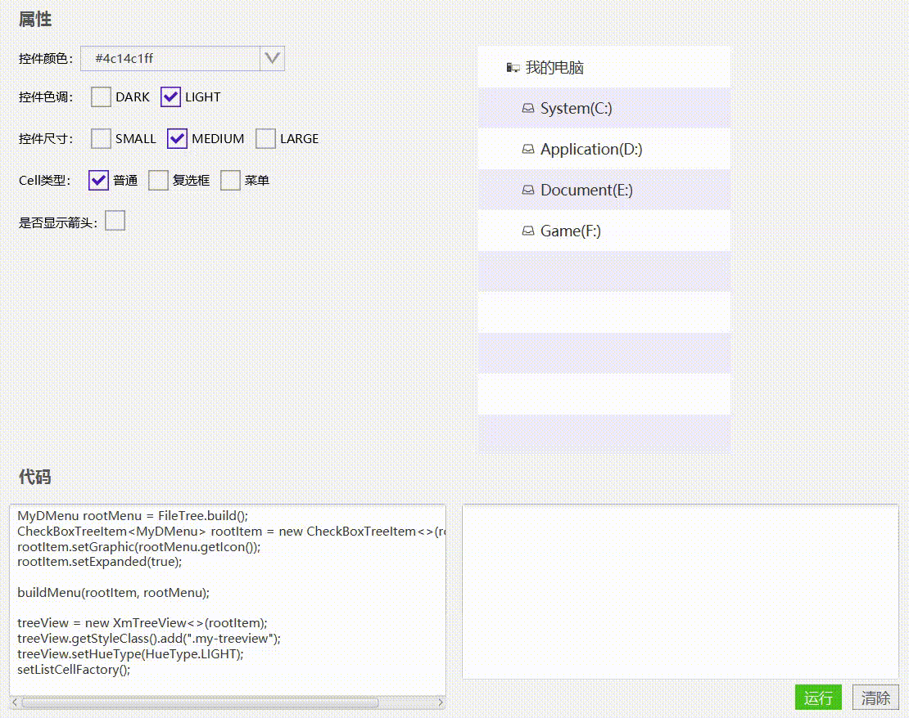

# 树形视图（XmTreeView）




## 使用

1, 准备数据

```java
MyDMenu rootMenu = FileTree.build();
```

2, 初始化

```java
CheckBoxTreeItem<MyDMenu> rootItem = new CheckBoxTreeItem<>(rootMenu);
rootItem.setGraphic(rootMenu.getIcon());
rootItem.setExpanded(true);

//构建菜单
buildMenu(rootItem, rootMenu);

XmTreeView<MyDMenu> treeView = new XmTreeView<>(rootItem);
treeView.setColorType(ColorType.danger());
treeView.setHueType(HueType.LIGHT);
treeView.getSelectionModel().setSelectionMode(SelectionMode.MULTIPLE);
```

```java
public void buildMenu(CheckBoxTreeItem<MyDMenu> parent, MyDMenu root){

     ObservableList<DropdownMenuItem> children = root.getChildren();

     if(children==null || children.size()==0){
         parent.getChildren().clear();
         return;
     }

     parent.getChildren().clear();
     for(DropdownMenuItem m : children){
         MyDMenu menu = (MyDMenu) m;
         CheckBoxTreeItem<MyDMenu> menuItem = new CheckBoxTreeItem<>();
         menuItem.setValue(menu);
         menu.getIcon().setMouseTransparent(true);
         menuItem.setGraphic(menu.getIcon());
         parent.getChildren().add(menuItem);
         buildMenu(menuItem, menu);
     }
}
```


3, 设置cellFactory

```java
//XmTreeCell
treeView.setCellFactory(new Callback<TreeView<MyDMenu>, TreeCell<MyDMenu>>() {
    @Override
    public TreeCell<MyDMenu> call(TreeView<MyDMenu> param) {
        return new XmTreeCell<>(){
            @Override
            public void updateItem(MyDMenu item, boolean empty) {
                super.updateItem(item, empty);
                if(empty){
                    setText(null);
                    setGraphic(null);
                }else{
                    setText(item.getLabelName());
                }
            }
        };
    }
});
});

//XmCheckBoxTreeCell
treeView.setCellFactory(new Callback<TreeView<MyDMenu>, TreeCell<MyDMenu>>() {
    @Override
    public TreeCell<MyDMenu> call(TreeView<MyDMenu> param) {
        return new XmCheckBoxTreeCell<>(new Callback<TreeItem<MyDMenu>, ObservableValue<Boolean>>() {
            @Override
            public ObservableValue<Boolean> call(TreeItem<MyDMenu> param) {
                if (param instanceof CheckBoxTreeItem<?>) {
                    return ((CheckBoxTreeItem<?>) param).selectedProperty();
                }
                return null;
            }
        }, new StringConverter<TreeItem<MyDMenu>>() {
            @Override
            public String toString(TreeItem<MyDMenu> object) {
                return object.getValue().getLabelName();
            }

            @Override
            public TreeItem<MyDMenu> fromString(String string) {
                return new TreeItem<>(new MyDMenu(string));
            }
        });
    }
});

```


[实例代码(TestTreeView)](../../Example/src/main/java/com/xm2013/example/test/TestTreeView.java)

[实例代码(TreeViewPage)](../../Example/src/main/java/com/xm2013/example/example/page/TreeViewPage.java)


